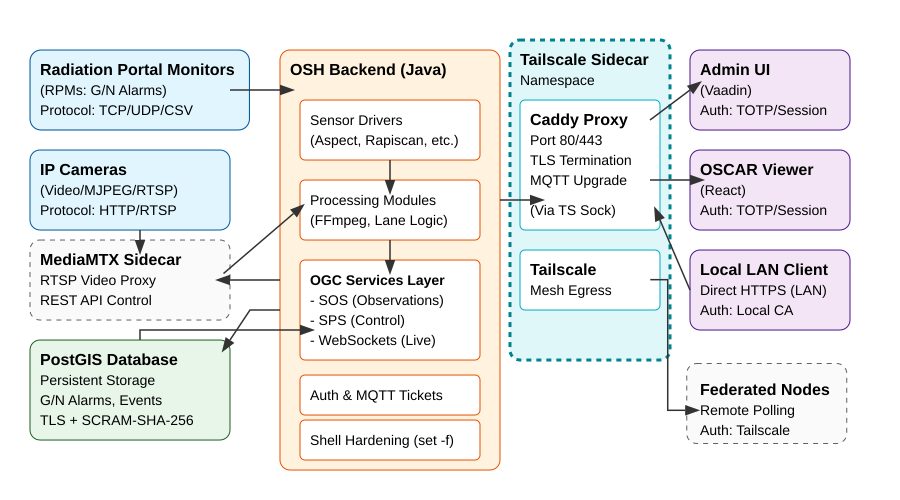

# OSCAR System Architecture

## Overview
OSCAR (Open Source Central Alarm Station) is a monitoring system for radiation portal monitors based on the OpenSensorHub (OSH) framework.

## Data Flow Diagram

## Component Network Flow and Ports

### Components:
- **OSH Backend**: Java-based core application.
- **PostGIS Database**: PostgreSQL with PostGIS extensions for persistent storage.
- **Client Web UI**: React/Frontend viewer.
- **Tailscale Sidecar**: A dedicated container running Tailscale to manage the local mesh network, handling proxy egress/ingress.
- **MediaMTX Sidecar**: A dedicated RTSP media proxy sidecar running on the host network (`network_mode: "host"`) that intercepts raw IP camera streams and forwards them reliably to the OSH FFmpeg sensors.

## Deployment Scenarios & Minimum System Requirements

OSCAR is designed to scale from edge devices to enterprise environments. You can configure your deployment by selecting a scenario in the `.env` file.

1. **Scenario A: "Edge Node" (1 Lane, All-in-One)**
   *   **Hardware**: Raspberry Pi (4GB-8GB RAM)
   *   **Setup**: Runs the complete stack (PostGIS, OSH, Proxy, Tailscale) locally.
2. **Scenario B: "Tactical Hub" (10 Lanes / 20 Cameras, All-in-One)** - **Default**
   *   **Hardware**: Powerful Laptop or Desktop (16GB RAM)
   *   **Setup**: Runs the complete stack locally with increased JVM and database memory limits.
3. **Scenario C: "Enterprise Central Hub" (50 Lanes / 100 Cameras, Distributed LAN)**
   *   **Hardware**: Machine 1 (App Server, 16GB RAM), Machine 2 (DB Server, 16GB RAM)
   *   **Setup**: Separates the database from the application backend over a high-speed LAN connection. See Deployment instructions below.

### Default Port Configuration:
- **Caddy Reverse Proxy (within Tailscale namespace)**: Operates entirely inside the sidecar's networking context. It does not map ports to the host file directly, but dynamically secures ports `80` (HTTP) and `443` (HTTPS) over the mesh.
- **OSH Backend API (HTTP)**: `8282` (Bound to `127.0.0.1` locally, accessible externally via proxy)
- **OSH Backend Admin UI**: `8282` (Bound to `127.0.0.1` locally, accessible externally via proxy)
- **PostGIS Database**: `5432` (Internal Docker Network only)
- **MQTT Server (HiveMQ)**: WebSockets on `/mqtt` (via proxy)
- **MediaMTX API (HTTP)**: `9997` (Bound to host, internal REST control)
- **MediaMTX RTSP Server**: `8554` (Bound to host, intercepts camera streams)

### Network Flows:
- **Client to OSH**: Clients interact with OSH through its REST API and Web UI via the reverse proxy on ports `80` or `443` (or port `8282` locally). The client is now progressive web app (PWA) compatible and can be installed locally via a modern web browser.
- **Client Features**: The progressive web application contains specialized functionality such as offline caching, client-side WebID analysis, and camera integration for Spectroscopic QR Code scanning during Adjudication workflows.
- **OSH to PostGIS**: The OSH backend connects to the PostGIS database over the network (local or LAN) on port `5432`. This connection is secured via TLS and authenticated with SCRAM-SHA-256.
- **Certificate Management**: OSH manages its own internal PKI. On first boot, a 20-year Root CA and a 1-year Leaf certificate are generated and stored in `osh-keystore.p12`. The system automatically renews the Leaf certificate if it is within 30 days of expiration during the boot sequence.

## Deployment and Lifecycle Commands

### Main Launch Commands:
The stack is fully containerized using Docker Compose. Official Docker images (`oscar-backend`, `oscar-postgis`) are published to Docker Hub for every release.

There are two ways to launch the stack:
- **Online (Docker Hub)**: Download the `docker-compose.yml` and `.env.example` from the latest release and run `docker compose up -d`. This will automatically pull the pre-built images.
- **Offline (Source)**: Extract the full `.zip` release artifact containing the Dockerfiles and run `docker compose up -d` from the root directory to build the images locally. Launch scripts in `dist/release/` (e.g., `launch-all.sh`, `launch-all.bat`) are provided for backward compatibility.

### Distributed Enterprise Deployment (Scenario C)
To deploy the Enterprise Central Hub profile, you must split the components across two distinct machines on the same local network (LAN). **Important Initialization Logic**: The system relies on a unified, randomly generated database password. Because the application and database will be on separate machines, you must manually sync this secret.

**Machine 2 (Database Server)**
1. Copy the repository release files.
2. In `.env`, uncomment the **Scenario C: Database Server Profile**.
3. Generate a secure database password and save it locally:
   - Linux: `mkdir -p secrets && openssl rand -base64 32 > secrets/.db_password`
4. Use the standalone Database script to launch the container:
   - `cd dist/release/postgis`
   - `./run-postgis.sh` (or `run-postgis.bat` for Windows).
5. Ensure the machine's firewall allows incoming connections on port `5432` from Machine 1.

**Machine 1 (Application Server)**
1. Copy the repository release files.
2. In `.env`, uncomment the **Scenario C: Application Server Profile**.
3. Set the `DB_HOST` in `.env` to the IP address of Machine 2.
4. Securely copy the `secrets/.db_password` file generated on Machine 2 and place it in the same `secrets/` path on Machine 1. *This guarantees the `init-secrets` pre-flight container will use the matching credentials instead of generating a conflicting random password.*
5. Launch the application stack: `docker compose up -d`. This will start the OSH backend, Tailscale sidecar, and Caddy proxy without launching a local database.

### Automated Provisioning Utilities:
Located in the repository root:
- `provision-node.sh`: Securely pushes an API key to a remote node via Tailscale (Unix/Linux/macOS).
- `provision-node.bat`: Securely pushes an API key to a remote node via Tailscale (Windows).

See [Federation Provisioning](docs/FEDERATION_PROVISIONING.md) and [Tailscale Configuration](docs/TAILSCALE_CONFIGURATION.md) for detailed setup and usage instructions.

### Standalone Database Scripts:
Located in `dist/release/postgis/`:
- `run-postgis.sh`: Starts the PostGIS container independently (Linux/macOS).
- `run-postgis-arm.sh`: Starts the PostGIS container independently (ARM64).
- `run-postgis.bat`: Starts the PostGIS container independently (Windows).

## Database Utilities
Cross-platform scripts are provided in the repository root for maintenance:
- `backup.sh/bat`: Safely creates a database dump.
- `restore.sh/bat`: Restores the database from a dump.

These utilities respect the `DB_HOST` and `POSTGRES_PASSWORD_FILE` environment variables.
